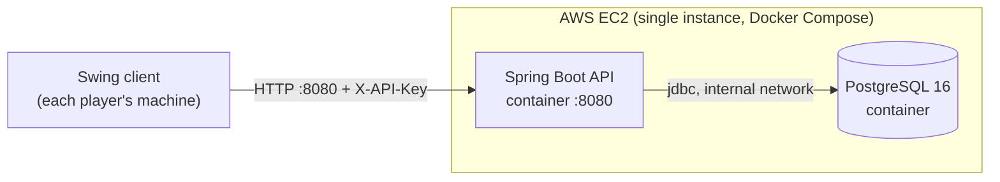
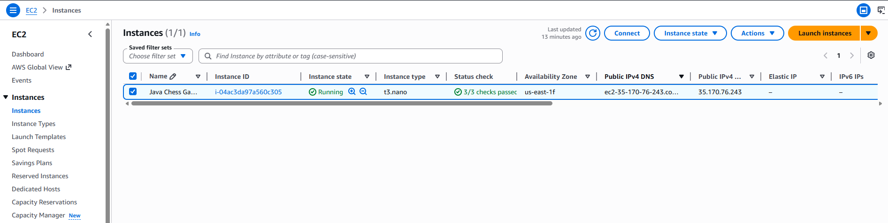
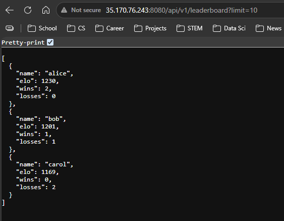

# Deploying the Backend to AWS EC2

This runbook deploys the **server + PostgreSQL** to a single AWS EC2 instance
using `docker-compose.prod.yml`. The Swing client stays on each player's machine
and is pointed at the deployed server via `CHESS_SERVER_URL` / `CHESS_API_KEY`.

The deployment is fully reproducible from the repo: the steps below clone the
project, inject secrets via environment variables, and bring the stack up with a
single command.

## Architecture



A single instance runs both containers to keep the footprint minimal. The API is
the only port exposed to the internet; PostgreSQL is reachable only on the
internal Docker network. A managed database (e.g. Amazon RDS) would be the next
step for a production workload, at the cost of a second always-on resource.

## Prerequisites

- An AWS account and an EC2 key pair for SSH access.
- Familiarity with the EC2 console and Docker.

## 1. Provision the instance

Launch an EC2 instance with:

- **AMI:** Amazon Linux 2023
- **Instance type:** `t3.micro` (Free Tier eligible)
- **Storage:** 30 GiB gp3, "Delete on termination" enabled
- **Security group (inbound):**
  | Port | Source      | Purpose            |
  | ---- | ----------- | ------------------ |
  | 22   | your IP     | SSH administration |
  | 8080 | `0.0.0.0/0` | REST API           |

  PostgreSQL (5432) and Adminer (8081) are intentionally **not** exposed.

## 2. Install the container runtime

SSH in, then install Docker, the Compose plugin, and Buildx (Compose builds
require Buildx >= 0.17):

```bash
sudo dnf update -y
sudo dnf install -y docker git
sudo systemctl enable --now docker
sudo usermod -aG docker ec2-user

sudo mkdir -p /usr/local/lib/docker/cli-plugins

# Compose plugin
sudo curl -SL https://github.com/docker/compose/releases/latest/download/docker-compose-linux-x86_64 \
  -o /usr/local/lib/docker/cli-plugins/docker-compose

# Buildx plugin (required to build images via Compose)
BUILDX_VER=$(curl -s https://api.github.com/repos/docker/buildx/releases/latest | grep -oP '"tag_name": "\K[^"]+')
sudo curl -SL "https://github.com/docker/buildx/releases/download/${BUILDX_VER}/buildx-${BUILDX_VER}.linux-amd64" \
  -o /usr/local/lib/docker/cli-plugins/docker-buildx

sudo chmod +x /usr/local/lib/docker/cli-plugins/docker-compose /usr/local/lib/docker/cli-plugins/docker-buildx
```

Reconnect (so the `docker` group applies), then confirm:

```bash
docker --version && docker compose version && docker buildx version
```

## 3. Tune for a constrained host

A `t3.micro` has 1 GiB of RAM, which the Gradle image build and the running
JVM + PostgreSQL can exhaust. Add 2 GiB of swap so builds and runtime stay
stable:

```bash
sudo dd if=/dev/zero of=/swapfile bs=1M count=2048
sudo chmod 600 /swapfile
sudo mkswap /swapfile && sudo swapon /swapfile
echo '/swapfile none swap sw 0 0' | sudo tee -a /etc/fstab
```

The application container additionally caps the JVM heap (`-Xmx320m`, set in
`docker-compose.prod.yml`) to fit alongside PostgreSQL.

## 4. Configure and launch

`docker-compose.prod.yml` differs from the local `docker-compose.yml` in three
ways: it omits Adminer, does not publish the database port, and requires
`POSTGRES_PASSWORD` and `APP_API_KEY` to be set (failing fast if they are not).

```bash
git clone https://github.com/Ian8912/ChessOOP.git && cd ChessOOP

export POSTGRES_PASSWORD='choose-a-strong-value'
export APP_API_KEY="$(openssl rand -hex 24)"   # record this; the client must send it

docker compose -f docker-compose.prod.yml up --build -d
```

> If the in-container Gradle build exhausts memory, build the image locally,
> push it to a registry, and replace the `build:` block with `image:` so the
> instance only pulls. Swap usually carries the build through, if slowly.

## 5. Verify

On the host:

```bash
docker compose -f docker-compose.prod.yml ps
curl http://localhost:8080/actuator/health                 # -> {"status":"UP"}
```

Then confirm it is reachable over the public internet (substitute the instance's
public IP):

```bash
curl "http://<public-ip>:8080/api/v1/leaderboard?limit=10"
```

The instance running the containerized backend:



The `/api/v1/leaderboard` endpoint returning ranked players from PostgreSQL over
the public internet:



To exercise the full path, point the client at the deployment:

```powershell
$env:CHESS_SERVER_URL="http://<public-ip>:8080"; $env:CHESS_API_KEY="<the key>"
gradlew.bat :client:run
```

## Cost management and teardown

This stack uses no RDS, load balancer, or NAT gateway, so cost is limited to the
single instance and its volume. To avoid charges when the deployment is no longer
needed:

1. Set a low **AWS Budget alert** (e.g. $1) as a safety net. Note the Free Tier
   covers a `t3.micro` for 12 months; afterward it is roughly $7-9/month.
2. **Terminate the instance** (EC2 -> Instances -> Instance state -> Terminate).
3. **Confirm the EBS volume is deleted.** With "Delete on termination" enabled it
   is removed automatically; delete any volume left in the `available` state, as
   detached volumes continue to bill.
4. **Release any Elastic IP** you allocated. An unassociated Elastic IP is a
   common source of unexpected charges.
5. **Delete any snapshots** created during the session.

Once the instance and its volume are gone (and no Elastic IP remains), the
deployment incurs no further cost.

## Re-deploying

Repeat steps 1-4. The application is stateless and the database starts empty
(local data is not transferred), so each deployment is clean.
