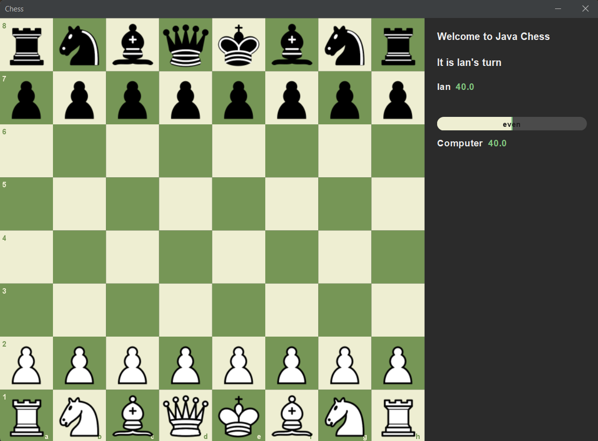
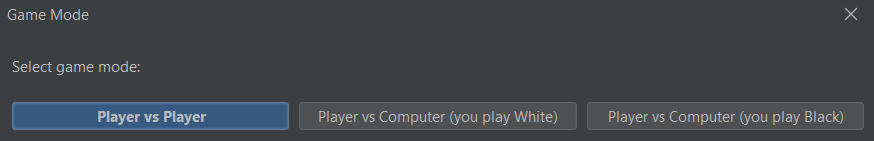
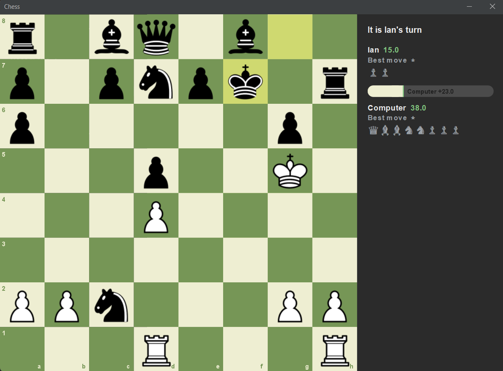
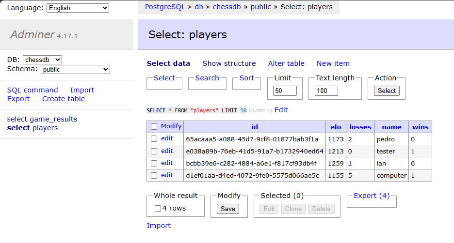

# Object-Oriented Programming GUI Chess Project

<strong>Developed by:</strong> Ian Lingo

<strong>Past contributors:</strong> Pedro Perez and Shaz Momin.

## Project Overview

This project showcases our understanding of <strong>Object-Oriented Programming (OOP)</strong> by building a fully
functional chess game using Java with a <strong>Swing-based GUI</strong>.  

## Development Notes

Originally built as a collaborative class project, I have since taken the lead on expanding the application far beyond the original requirements. My additions include:

- Creating JavaDocs documentation.
- Migrating the project to a multi-module Gradle build (client + server).
- Adding a **computer opponent (AI)** that selects moves with a negamax search (alpha-beta pruning + quiescence), so it weighs the opponent's reply instead of grabbing material blindly.
- Adding **per-move quality grading** (Best move → Blunder) shown to each player, using the same two-sided evaluation.
- Adding **check, checkmate, and stalemate detection** with end-of-game dialogs.
- Redesigning the **GUI** with a modern flat theme, move highlights, board coordinates, and an info panel showing live material score, an advantage bar, and captured pieces.
- Implementing a Spring Boot backend for leaderboards and results, with REST APIs and Elo rating updates.
- Storing data in **PostgreSQL**, with a one-command **Docker Compose** stack (API + database + a web database viewer).
- **Containerizing** the server (multi-stage Dockerfile), adding a health-check endpoint, and securing the write endpoint with an API key.
- Switching integration tests to **Testcontainers** (a real PostgreSQL spun up for tests) and adding JUnit 5 unit tests.
- Integrating the Swing client with the server to automatically POST game results upon completion, with a configurable server URL and API key.

## Modules

- client/  
  - `Game`: Handles the game board, movement validation, input handling, and UI rendering.  
  - `Piece`: Contains all chess piece classes (`Pawn`, `Rook`, `Bishop`, etc.) with piece-specific logic.

- server/  
  - Spring Boot REST API backed by PostgreSQL. Stores player profiles, Elo ratings, and game results.

The entry point is the `GameRun.java` file within the `Game` package, which initializes and launches the chess
game interface.  

## Features

### Client (Swing)

- **Game modes** chosen at launch: Player vs Player, or Player vs Computer (pick whether you play White or Black).
- **Computer opponent (AI):** chooses moves with a negamax search (alpha-beta pruning + a capture-resolving quiescence search), so it considers the opponent's reply and avoids hanging pieces.
- **Move grading:** every move is rated — Best move ⭐, Excellent, Good, Inaccuracy ?!, Mistake ?, or Blunder ?? — based on how much it loses versus the best available move.
- **Full rule enforcement:** per-piece legal moves, turn order, pawn promotion to a Queen, and **check / checkmate / stalemate** detection with an end-of-game dialog.
- **Modern board UI:** anti-aliased rendering, a chess.com/lichess-style color scheme, file/rank coordinate labels, and a FlatLaf dark theme.
- **Move highlights:** the selected piece's square, its legal destinations (dots) and captures (rings), the last move played, and a king in check.
- **Info side panel:** whose turn it is / check status, each side's live material score with an advantage bar, captured pieces, and each side's latest move grade.
- Click-and-drag piece movement; prompts for player name(s) before the game.
- On game end, the result is **automatically sent to the server** (silently skipped if the server is offline).

### Server (Spring Boot)

- REST endpoints:
  - `POST /api/v1/results` -> record a game result (creates/updates players, applies Elo)
  - `GET /api/v1/leaderboard?limit=N` -> top N players by Elo, then wins
- Player "profiles" are automatically created or updated by name.
- **Elo rating system** (K-factor 32) with wins/losses tracked.
- Backed by **PostgreSQL**; `docker compose up -d` runs the **API + database + Adminer** (a web database viewer) together.
- **`/actuator/health`** endpoint for container / load-balancer health checks.
- **API-key guard** on the write endpoint (`X-API-Key`), enabled by setting `APP_API_KEY` (left blank for easy local dev).
- Fully **env-var configurable** (datasource, API key), so the same Docker image runs locally and in the cloud.
- Integration test runs against a **real PostgreSQL via Testcontainers**.
- Game results are automatically received from the Swing client upon game completion.

## How to Run

### Prerequisites

- **Java 24** (the Gradle toolchain will fetch it if missing)
- **Gradle wrapper** (included — use `gradlew` / `gradlew.bat`)
- **Docker Desktop** — required to run the backend, and to run the server tests (they use Testcontainers). You can play the chess game without it; results just won't be saved.

### Quick Start

<pre># 1) Start the backend (PostgreSQL + API + Adminer DB viewer)
docker compose up -d

# 2) Play chess — results save automatically, no API key needed locally
gradlew.bat :client:run

# 3) See the leaderboard
#    http://localhost:8080/api/v1/leaderboard   (raw JSON)
#    http://localhost:8081                       (Adminer, browse the tables)

# When you're done
docker compose down</pre>

> You can also just play without the backend: run only step 2. The game works fully; it simply won't record results.

#### Run Client (GUI Chess):

On launch you'll be asked to pick a **game mode** (Player vs Player, or Player vs Computer as White/Black) and enter player name(s).

<pre># On macOS/Linux
./gradlew :client:run

# On Windows
gradlew.bat :client:run </pre>

#### Run Server (REST API):

The server is backed by PostgreSQL, so run it with Docker (see
**Run the full backend with Docker** below) — that starts the database, the API,
and a web DB viewer together. To run the API on its own against a database, see
**Run the API against Postgres without Docker**.

#### Run the full backend with Docker (recommended)

This starts everything — PostgreSQL, the REST API, and a web database viewer —
with a single command. Requires Docker Desktop to be running.

<pre># Build and start Postgres + API + Adminer
docker compose up --build -d

# Stop everything (keeps the database data)
docker compose down

# Stop AND wipe the database (fresh start)
docker compose down -v</pre>

Once it is up, open these in your browser:

| What                              | URL                                        |
| --------------------------------- | ------------------------------------------ |
| Leaderboard (live JSON)           | `http://localhost:8080/api/v1/leaderboard` |
| **Adminer — browse the database** | `http://localhost:8081`                    |
| Health check                      | `http://localhost:8080/actuator/health`    |

**Logging into Adminer** (to see the `players` and `game_results` tables):

| Field    | Value      |
| -------- | ---------- |
| System   | PostgreSQL |
| Server   | `db`       |
| Username | `chess`    |
| Password | `secret`   |
| Database | `chessdb`  |

The data is created by playing games in the client. Locally, just run the client —
it posts to `http://localhost:8080` by default and no API key is required:

<pre># On Windows
gradlew.bat :client:run</pre>

If you connect to a deployed server that sets `APP_API_KEY`, pass the matching key:

<pre>$env:CHESS_SERVER_URL="https://your-host"; $env:CHESS_API_KEY="YOUR_KEY"
gradlew.bat :client:run</pre>

> The Docker Postgres is published on host port **5434** (not 5432) to avoid
> clashing with any PostgreSQL you have installed locally. To connect a desktop
> tool like pgAdmin to the Docker database, use `localhost:5434`.

#### Run the API against Postgres without Docker (optional)

<pre># Start just the database container
docker compose up -d db

# On macOS/Linux (defaults already point at localhost:5434, so env vars are optional)
./gradlew :server:bootRun

# On Windows (PowerShell) — override the connection only if needed
$env:SPRING_DATASOURCE_URL="jdbc:postgresql://localhost:5434/chessdb"
$env:SPRING_DATASOURCE_USERNAME="chess"; $env:SPRING_DATASOURCE_PASSWORD="secret"
gradlew.bat :server:bootRun </pre>

#### Test the API directly (optional)

With the backend running, you can hit the endpoints with `curl`:

<pre># record a result (White beats Black). No API key needed locally; in a deployed
# environment that sets APP_API_KEY, add: -H "X-API-Key: YOUR_KEY"
curl -X POST http://localhost:8080/api/v1/results \
  -H "Content-Type: application/json" \
  -d '{"whiteName":"Alice","blackName":"Bob","winner":"WHITE"}'

# fetch leaderboard
curl "http://localhost:8080/api/v1/leaderboard?limit=10" </pre>

## Configuration

Everything is configurable via environment variables (or `-D` system properties for the client), so the same build runs locally and against a deployed server.

**Client**

| Variable           | Default                 | Purpose                                                     |
| ------------------ | ----------------------- | ----------------------------------------------------------- |
| `CHESS_SERVER_URL` | `http://localhost:8080` | Where the client sends game results                         |
| `CHESS_API_KEY`    | _(none)_                | Sent as `X-API-Key`; only needed if the server requires one |

(equivalently: `gradlew.bat :client:run -Dchess.server.url=... -Dchess.api.key=...`)

**Server**

| Variable                     | Default                                    | Purpose                                    |
| ---------------------------- | ------------------------------------------ | ------------------------------------------ |
| `SPRING_DATASOURCE_URL`      | `jdbc:postgresql://localhost:5434/chessdb` | Database connection                        |
| `SPRING_DATASOURCE_USERNAME` | `chess`                                    | Database user                              |
| `SPRING_DATASOURCE_PASSWORD` | `secret`                                   | Database password                          |
| `APP_API_KEY`                | _(blank → guard disabled)_                 | If set, required on `POST /api/v1/results` |

> ⚠️ Leaving `APP_API_KEY` blank disables the write guard. That's intentional for local dev; **always set it in a deployed environment.**

## Tests

<pre># All modules
gradlew.bat test

# Server only — requires Docker (Testcontainers starts a real PostgreSQL)
gradlew.bat :server:test

# Client only
gradlew.bat :client:test</pre>

## Deployment

The backend is containerized and driven entirely by environment variables, so only the **server + database** are hosted — the Swing client keeps running on each player's machine, pointed at the deployed server via `CHESS_SERVER_URL` / `CHESS_API_KEY`.

To deploy (e.g. AWS App Runner / ECS / Elastic Beanstalk):

1. Build the image from the included `Dockerfile`.
2. Run a managed PostgreSQL (e.g. **Amazon RDS**) and set `SPRING_DATASOURCE_URL` / `_USERNAME` / `_PASSWORD`.
3. Set `APP_API_KEY` to turn on the write guard, and give clients the matching `CHESS_API_KEY`.
4. The platform health-checks `/actuator/health`.

> Local data lives in the Docker `pgdata` volume on your machine and does **not** transfer — a deployed database starts empty.

## Project Significance

<ul>
    <li> Demonstrates <strong>Object-Oriented Principles and Design</strong> (abstraction, polymorphism, inheritance, encapsulation).</li>
    <li> GUI development using <strong>Java Swing</strong> with custom <code>Graphics2D</code> rendering.</li>
    <li> <strong>Algorithms:</strong> adversarial search (negamax, alpha-beta pruning, quiescence) and an Elo rating system.</li>
    <li> Practical use of <strong>Gradle (Kotlin DSL)</strong> multi-module builds.</li>
    <li> Backend experience with <strong>Spring Boot, REST APIs, and PostgreSQL</strong>, including a basic API-key auth guard.</li>
    <li> <strong>DevOps:</strong> Docker, Docker Compose, multi-stage image builds, Testcontainers, and health checks.</li>
    <li> Collaboration with <strong>Git</strong>, version control, and clean architecture.</li>
</ul>

## Documentation

View Full JavaDocs Online: [Click here to open the JavaDocs](https://ian8912.github.io/ChessOOP/)

Thank you for checking out this project!
